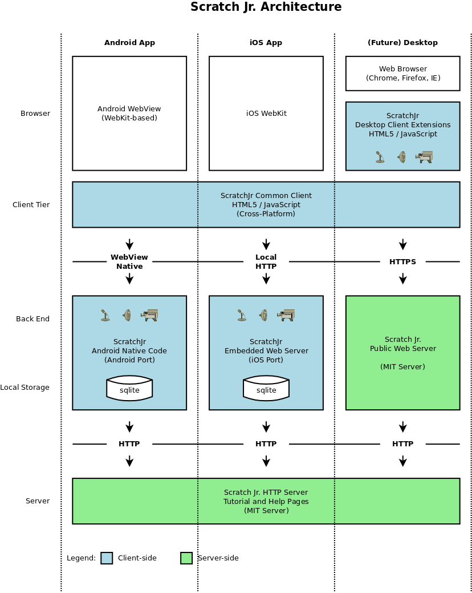

## Overview
This is the official git repository hosting the source code for the
[ScratchJr](http://scratchjr.org/) project.

ScratchJr can be built both for iOS and Android.
A pure-web version or Chrome-app version is planned to follow at some point in the future.

Platform | Status
-------- | -------------
iOS      | Released in App Store
Android  | Released in Google Play and Amazon store

## Release Schedule

As of this writing, the Android version now supports Android 4.2
and above.

## Architecture Overview
The diagram below illustrates the architecture of ScratchJr and
how the iOS (functional), Android (functional) and pure HTML5 (future)
versions share a common client.

## Directory Structure and Projects
This repository has the following directory structure:

* <tt>src/</tt> - Shared Javasript code for iOS and Android common client. This is where most changes should be made for features, bug fixes, UI, etc.
* <tt>editions/</tt> - Assembly directories for each "flavor" of ScratchJr. These symlink to src for common code, and could diverge in settings and assets.
 * <tt>free/</tt> - Free edition JavaScript, including all shared code for all releases
* <tt>android/</tt> - Android port of Scratch Jr. (Java, Android Studio Projects)
  * <tt>ScratchJr/</tt> - Android Studio Project for ScratchJr Android Application
* <tt>bin/</tt> - Build scripts and other executables
* <tt>doc/</tt> - Developer Documentation
* <tt>ios/</tt> - XCode project for iOS build.

## Building ScratchJr
To build the Android version, you need to have a system equipped with Android Studio. To build the iOS version, you need to have a Mac with XCode.

Ensure you have node and npm [installed](http://blog.npmjs.org/post/85484771375/how-to-install-npm).

With all of the code checked out, you must install npm dependencies for bundling the JavaScript:
* <tt>npm install</tt>

The build caches .png files out of the .svg files to improve performance. To enable this build step, you need to install a few dependencies.

On Ubuntu:

* Run <tt>sudo easy_install pysvg</tt> to install python svg libraries
* Run <tt>sudo apt-get install librsvg2-bin</tt> to install rsvg-convert
* Run <tt>sudo apt-get install imagemagick</tt> to install ImageMagick

On OS X:

* Install [Homebrew](http://brew.sh).
* Run <tt>sudo easy_install pysvg</tt> to install python svg libraries
* Run <tt>brew install librsvg</tt> to install rsvg-convert
* Run <tt>brew install imagemagick</tt> to install ImageMagick

Once these are installed, select the appropriate target in XCode or the appropriate flavor/build variant in Android Studio.

## Where and how to make changes

All changes should be made in a fork. Before making a pull request, ensure all changes pass our linter:
* <tt>npm run lint</tt>

For more information, see [CONTRIBUTING.md](CONTRIBUTING.md).

## Code credits
ScratchJr would not be possible without free and open source libraries, including:
* [Snap.svg](https://github.com/adobe-webplatform/Snap.svg/)
* [JSZip](https://github.com/Stuk/jszip)
* [Intl.js](https://github.com/andyearnshaw/Intl.js)
* [Yahoo intl-messageformat](https://github.com/yahoo/intl-messageformat)

## Acknowledgments
ScratchJr is a collaborative effort between:

* [Tufts DevTech Research Group](http://ase.tufts.edu/devtech/)
* [Lifelong Kindergarten group at MIT Media Lab](http://llk.media.mit.edu/)
* [Playful Invention Company](http://www.playfulinvention.com/)
* [Two Sigma Investments](http://twosigma.com)
